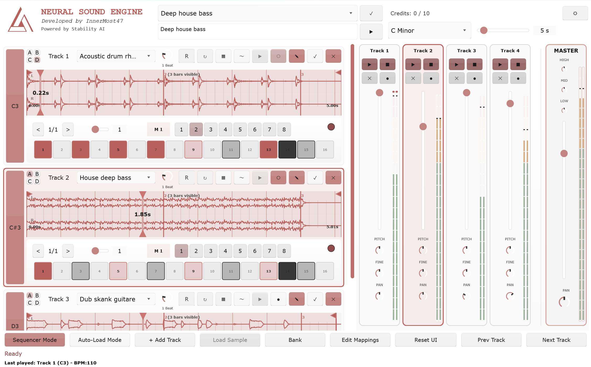

# OBSIDIAN-Neural

🎵 **Real-time AI music generation VST3 plugin for live performance**

---

> _"I've cycled through almost every AI music tool on the market, but Obsidian is the first one that actually feels like a **real production tool** rather than a novelty. While other AI apps try to replace the songwriter, Obsidian treats AI like a powerful, playable instrument. The 8-track MIDI-triggering is a total game-changer—having immediate access to eight distinct loops that I can mix and manipulate individually makes it feel like a **smart sampler** rather than a 'black box.' Because it lives directly in my DAW, there is **zero latency** and zero break in my workflow; I'm not downloading files or waiting for a browser to render. It stays perfectly locked to my project's tempo and vibe, serving as the ultimate **'intelligent jam partner VST'** whenever I need to break through a creative block, or start a new track from scratch."_
>
> **— Moteka, Electronic Music Producer**  
> [SoundCloud](https://soundcloud.com/moteka) • [Instagram](https://www.instagram.com/pmoteka/)

---

**⚡ Quick Start:** [Get your API key](https://obsidian-neural.com) and start generating in minutes — no GPU or setup required.

🎁 **7-Day FREE Trial** - Try any plan risk-free with no credit card required to start!

📄 **[Late Breaking Paper - AIMLA 2025](https://drive.google.com/file/d/1cwqmrV0_qC462LLQgQUz-5Cd422gL-8F/view)** - Presented at the first AES International Conference on Artificial Intelligence and Machine Learning for Audio (Queen Mary University London, Sept 8-10, 2025)  
🎓 **[Tutorial](https://youtu.be/-qdFo_PcKoY)** - From DAW setup to live performance (French + English subtitles)

<div align="center">
  
  <p><i>Live AI music generation in your DAW</i></p>
</div>

---

## Draw-to-Audio Live Demo

**Watch the draw-to-audio feature in action** - Live improvisation session showing real-time sketch-to-sound generation:

[](https://youtu.be/zhJ865KoPCU)

_Raw improvisation showcasing the experimental draw-to-audio workflow: sketch patterns → AI interprets visuals → generates matching loops on the fly._

---

## What Obsidian Neural does

Type words → Get musical loops instantly. No stopping your creative flow.

- **8-track sampler** with MIDI triggering (C3-B3)
- **4 pages per track** (A/B/C/D) - Switch variations instantly
- **8 sequences per page** - 256 total patterns for complex live sets
- **16-step sequencer** with multi-measure support
- **Quantized page changes** - Seamless transitions locked to measure boundaries
- **Draw-to-sound** - Sketch your ideas visually and let AI interpret them musically
- **Perfect DAW sync** - Auto time-stretch to project tempo
- **Real-time generation** - No pre-recorded samples

**Text example:** Type "dark techno kick" → AI generates techno loop → Program sequence → Switch between 8 pattern variations

**Performance example:**

- Page A: Main groove (8 sequences)
- Page B: Breakdown variation (8 sequences)
- Page C: Build-up (8 sequences)
- Page D: Drop (8 sequences)
- Switch pages at measure boundaries while performing live

---

## What Obsidian Neural does NOT

**OBSIDIAN Neural is NOT a song generator** like Suno or Udio. It's a performance tool for musicians:

- **No full songs in one click** - You build your track loop by loop
- **No lyrics or vocals** - Focus on instrumental loops and sound design
- **No auto-arrangement** - You're the composer, AI is your loop generator

**Think of it as:** A creative sampler that generates sounds on-demand, not a "press play and get a song" tool.

---

## Features

### Multi-Layer Performance System

**256 independent patterns at your fingertips** - Each of the 8 tracks features a powerful multi-page, multi-sequence architecture:

- **4 pages per track** (A/B/C/D) - Switch variations instantly with page buttons
- **8 sequences per page** - Independent MIDI patterns per page (32 sequences per track total)
- **Live page switching** - Quantized to measure boundaries for seamless transitions
- **Per-page sequence memory** - Each page remembers its active sequence
- **Quantized beat repeat** - Stutter/retrigger effects locked to tempo (1/4 to 1/128 subdivisions)
- **Random retrigger intervals** - Enable automatic random interval selection for evolving patterns
- **Seamless loop points** - Adjustable start/end points per page with auto-crossfade

**Example workflow:**

- Track 1, Page A, Sequence 1: Simple 4-on-floor kick
- Track 1, Page A, Sequence 2: Broken beat variation
- Track 1, Page B, Sequence 1: Minimal pattern
- Enable beat repeat on Track 1 → Instant stuttered fills
- Switch pages and sequences on the fly during performance

### Beat Repeat & Performance FX

**Quantized stutter effects** that stay locked to your DAW tempo:

- **10 interval presets**: 4 bars, 2 bars, 1 bar, 1/2, 1/4, 1/8, 1/16, 1/32, 1/64, 1/128
- **Half-beat quantization** - Beat repeat triggers snap to nearest half-beat
- **Random duration mode** - Automatically randomizes interval length (1-10) on each trigger
- **MIDI learnable** - Map beat repeat toggle and interval knob to any controller
- **Visual feedback** - Interval knob displays current subdivision

**How it works:**

1. Load a sample on any track
2. Enable beat repeat
3. Adjust interval knob (or enable random mode)
4. Effect triggers quantized to half-beats
5. Returns to original playback seamlessly

**Performance tricks:**

- Use on drum loops for instant fill variations
- Combine with page switching for complex breakdowns
- Enable random duration for evolving glitch textures
- MIDI map to foot controller for hands-free triggering

### Text-to-Audio Generation

Type natural language descriptions and get instant musical loops:

- "dark techno kick"
- "ambient pad with reverb"
- "808 bass with distortion"

### Draw-to-Audio Generation

**Express your musical ideas visually** _(original concept by A.D.)_ - Each track includes a drawing canvas where you can sketch patterns, shapes, or abstract concepts. The AI analyzes your drawing using a Vision Language Model (VLM) and translates visual elements into musical descriptions:

1. Click the **Draw** button on any track
2. Use pencil, brush, spray, or eraser tools
3. Choose colors and brush sizes
4. Click **Generate** to send your drawing

**How it works:**

- Your drawing is encoded as Base64 image data
- A Vision Language Model interprets the visual elements using musical vocabulary
- The generated textual description is sent to the audio generation model
- Result: A unique sound that matches your visual concept

**Example workflow:**

- Draw sharp, angular lines → AI interprets as "aggressive staccato synth"
- Sketch flowing curves → AI interprets as "smooth flowing pad"
- Use red/orange colors → AI might associate with "warm analog tones"
- Create chaotic patterns → AI interprets as "glitchy percussion"

**Canvas features:**

- 512x512 drawing area
- 4 brush types (Pencil, Brush, Spray, Eraser)
- 10 color presets
- Adjustable brush size (1-50)
- State preservation per track/page

This feature bridges the gap between visual creativity and sonic experimentation, allowing producers to explore sound design through intuitive visual metaphors.

**Note:** This draw-to-audio feature is currently experimental and under active development.

---

## Quick Start

### 🟣 Cloud Inference API (Recommended)

**Generate AI loops directly from your DAW with zero setup. Professional quality.**

1. Download VST3 from [Releases](https://github.com/innermost47/ai-dj/releases)
2. Get your API key from [obsidian-neural.com](https://obsidian-neural.com)
3. Load the VST in your DAW
4. Configure in the plugin:
   - Click the **⚙️ settings button** (top right) or wait for the first-time setup dialog
   - Choose "Server/API" mode
   - Enter Server URL: `https://api.obsidian-neural.com`
   - Enter your API key
   - Click "Save & Continue"

👉 **Detailed setup guide:**  
📘 [Getting Started](https://obsidian-neural.com/documentation.html?page=getting-started)  
🎚️ [First Step - Using the Plugin in Your DAW](https://obsidian-neural.com/documentation.html?page=first-step)  
🎨 [Draw-to-Audio - Express Your Musical Ideas Visually](https://obsidian-neural.com/documentation.html?page=draw-to-audio)  
🎛️ [Bank Management - Organize and Manage Your Generated Sounds](https://obsidian-neural.com/documentation.html?page=bank-management)

**Pricing:**

- **Free**: 10 credits (10 samples) - Try it out
- **Base**: €5.99/month - 200 credits (200 samples)
- **Starter**: €14.99/month - 500 credits (500 samples)
- **Pro**: €29.99/month - 1500 credits (1500 samples)

Each generation costs **1 credit** (1 LLM generation + 1 audio generation). Samples up to 30 seconds, ~20s generation time.

**🎁 7-Day FREE Trial on All Plans:**

- Every plan includes a 7-day free trial
- Trial credits: Base (50), Starter (100), Pro (150)
- After trial: Full monthly credits (200/500/1500)
- No credit card required to start - just your email
- Cancel anytime - zero risk, zero commitment
- Add payment details during trial to continue after 7 days
- If you don't add payment, your subscription automatically cancels - no surprises

**Benefits:**

- Zero setup - Works immediately
- Professional quality
- Variable duration (up to 30s)
- No GPU or powerful hardware required
- Perfect for live performance

---

### 🔵 Self-Hosted Server + GPU (Advanced)

**Best for privacy, customization, and unlimited generations.**

1. Get [Stability AI access](https://huggingface.co/stabilityai/stable-audio-open-1.0)
2. Follow [build from source instructions](INSTALLATION.md)
3. Run server interface: `python server_interface.py`
4. Download VST3 from [Releases](https://github.com/innermost47/ai-dj/releases)
5. Load the VST in your DAW
6. Configure in the plugin:
   - Click the **⚙️ settings button** (top right) or wait for the first-time setup dialog
   - Choose "Server/API" mode
   - Enter your local server URL (default: `http://localhost:8000`)
   - Leave API key empty for local server
   - Click "Save & Continue"

👉 **Complete installation guide:** See [INSTALLATION.md](INSTALLATION.md) for:

- Platform-specific installation scripts (Windows, macOS, Linux)
- GPU detection and optimization (CUDA, Metal, ROCm)
- VST3 + AU building (macOS includes Audio Unit format)
- Troubleshooting and prerequisites

**Quick install commands:**

**Windows:**

```cmd
git clone https://github.com/innermost47/ai-dj.git
cd ai-dj
install-win.bat
```

**macOS:**

```bash
git clone https://github.com/innermost47/ai-dj.git
cd ai-dj
chmod +x install-mac.sh
./install-mac.sh
```

**Linux:**

```bash
git clone https://github.com/innermost47/ai-dj.git
cd ai-dj
chmod +x install-lnx.sh
./install-lnx.sh
```

**Benefits:** Unlimited generations, full privacy, variable duration

**Requirements:** GPU with CUDA support (NVIDIA) or Metal (Apple Silicon), Python environment

---

### 🟢 Local Models (Offline - Windows only)

**Runs completely offline. No servers, Python, or GPU needed.**

1. Get [Stability AI access](https://huggingface.co/stabilityai/stable-audio-open-small)
2. Download models from [innermost47/stable-audio-open-small-tflite](https://huggingface.co/innermost47/stable-audio-open-small-tflite)
3. Copy to `%APPDATA%\OBSIDIAN-Neural\stable-audio\`
4. Download VST3 from [Releases](https://github.com/innermost47/ai-dj/releases)
5. Choose "Local Model" in plugin

**Requirements:** 16GB+ RAM, Windows

**Current limitations:**

- Fixed 10-second generation
- Some timing/quantization issues
- High RAM usage

---

## Which Option Should I Choose?

| Feature                   | Cloud API               | Self-Hosted                    | Local Models          |
| ------------------------- | ----------------------- | ------------------------------ | --------------------- |
| **Setup Difficulty**      | ⭐ Easy                 | ⭐⭐⭐ Advanced                | ⭐⭐ Moderate         |
| **Hardware Requirements** | None                    | GPU + CUDA/Metal               | 16GB+ RAM             |
| **Generation Quality**    | ⭐⭐⭐ Best             | ⭐⭐ Good                      | ⭐ Basic              |
| **Variable Duration**     | ✅ Up to 30s            | ✅ Yes                         | ❌ Fixed 10s          |
| **Cost**                  | Pay per use             | Free (after setup)             | Free                  |
| **Privacy**               | Data processed on cloud | Full privacy                   | Full privacy          |
| **Internet Required**     | ✅ Yes                  | ❌ No                          | ❌ No                 |
| **Best For**              | Beginners, live gigs    | Privacy-focused, unlimited use | Offline work, testing |

---

## 🌍 Press Coverage

Featured in **8 countries** and **6 languages** across major music production publications:

- 🇺🇸 **[Synthtopia](https://www.synthtopia.com/content/2025/12/22/obsidian-neural-brings-ai-generated-samples-to-your-daw/)** - "Brings AI-Generated Samples To Your DAW"
- 🇨🇳 **[MIDIFAN](https://www.midifan.com/modulenews-detailview-57259.htm)** - Leading Chinese music tech publication (multiple features)
- 🇰🇷 **[S1 Forum](https://s1forum.kr/news/innermost47%EC%97%90%EC%84%9C-obsidian-neural-%EA%B3%B5%EA%B0%9C/)** - Korean music production community
- 🇳🇱 **[Rekkerd](https://rekkerd.org/obsidian-neural-real-time-ai-music-generation-vst3/)** - "Real-time AI music generation VST3"
- 🇫🇷 **[Audiofanzine](https://fr.audiofanzine.com/sequenceur-divers/obsidian-neural/obsidian-neural/news/a.play,n.78783.html)** - Major French music technology publication
- 🇪🇸 **[FutureMusic](https://www.futuremusic-es.com/obsidian-neural-vst3-ia-generativa/)** - Spanish music production coverage
- 🇯🇵 **[DTM Plugin Sale](https://projectofnapskint.com/obsidian-2/)** - Japanese music production community
- 🇺🇸 **[Bedroom Producers Blog](https://bedroomproducersblog.com/2025/06/06/obsidian-neural-sound-engine/)** - "FREE AI-powered jam partner"

> _"Too many AI projects focus on the things AI can save you from doing rather than how AI can help you get better at what you do."_  
> **— James Nugent, Bedroom Producers Blog**

**[See all press coverage →](PRESS.md)**

---

## Community

**🎯 Share your jams!** I'm the only one posting OBSIDIAN videos so far. Show me how YOU use it!

📧 **Contact:** [Form](https://obsidian-neural.com/contact.html)  
💬 **Discussions:** [GitHub Discussions](https://github.com/innermost47/ai-dj/discussions)  
📺 **Examples:** [Community Sessions](YOUTUBE.md)  
🌐 **Website:** [obsidian-neural.com](https://obsidian-neural.com)

[](https://youtu.be/cFmRJIFUOCU)

---

## Download

**VST3 Plugin:**

- [Windows](https://github.com/innermost47/ai-dj/releases)
- [macOS](https://github.com/innermost47/ai-dj/releases) (VST3 + AU formats)
- [Linux](https://github.com/innermost47/ai-dj/releases)

**Install to:**

- **Windows:** `C:\Program Files\Common Files\VST3\`
- **macOS VST3:** `~/Library/Audio/Plug-Ins/VST3/`
- **macOS AU:** `~/Library/Audio/Plug-Ins/Components/`
- **Linux:** `~/.vst3/`

---

## Status & Support

🚀 **Active development** - Updates pushed regularly  
⭐ **167+ GitHub stars** - Thanks for the support!  
🐛 **Issues:** [Report bugs here](https://github.com/innermost47/ai-dj/issues/new)

---

## 🎯 Community Milestone

**Road to 200 Stars!** Currently at 167+ 🌟

When we hit 200 stars, we're celebrating with a community giveaway:

**Prize:** 1 year of Starter Pack free access (€179.88 value)  
**Eligibility:** Active community members (stars, discussions, issues, contributions)

👉 [Join the discussion](https://github.com/innermost47/ai-dj/discussions/156)

Every star, contribution, and piece of feedback helps make Obsidian Neural better. Thank you for being part of this journey! 🙏

---

## 📚 Documentation

- **[Installation Guide](INSTALLATION.md)** - Complete setup instructions with platform-specific scripts
- **[Video Tutorial](https://youtu.be/-qdFo_PcKoY)** - Full walkthrough (French + English subtitles)
- **[Online Documentation](https://obsidian-neural.com/documentation.html)** - Comprehensive guide
- **[Press Coverage](press.md)** - Media features and reviews

---

## License

- 🆓 **GNU Affero General Public License v3.0** (Open source)
- **AI Model:** Stability AI Community License

---

## More Projects

### 🎵 Music Production Tools

🥁 **[BeatCrafter](https://github.com/innermost47/beatcrafter)** - Intelligent MIDI drum pattern generator VST3  
_Proof of concept for live performance with foot controller. Generates authentic drum patterns that evolve from simple to complex._

🎛️ **[Randomizer](https://randomizer.anthony-charretier.fr/)** - Generative music studio  
_Experimental web-based music creation tool with procedural generation._

### 🎧 Audio Content

🎵 **[YouTube Channel](https://www.youtube.com/@innermost9675)** - Original compositions  
_Electronic music, ambient soundscapes, metal, and experimental productions by InnerMost (2010-2023)._

### 💬 Connect

📧 **Contact:** [Form](https://obsidian-neural.com/contact.html)  
💬 **GitHub:** [@innermost47](https://github.com/innermost47)  
🌐 **Website:** [anthony-charretier.fr](https://anthony-charretier.fr)

---

## Credits & Attribution

**Developed by InnerMost47 (Anthony Charretier)**

Special thanks to:

- **A.D.** for the original draw-to-audio concept
- **Moteka** for the incredible testimonial and early adoption
- Stability AI for Stable Audio Open
- The open-source community
- All beta testers and early adopters

---

**OBSIDIAN-Neural** - Where artificial intelligence meets live music performance.

_Made with 🎵 in France_

[](https://obsidian-neural.com)
[](https://obsidian-neural.com/status.html)
[](LICENSE)
[](https://github.com/innermost47/ai-dj)
